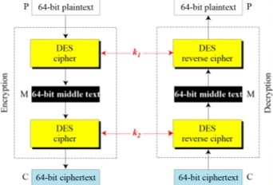
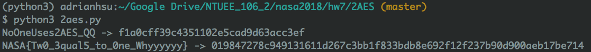
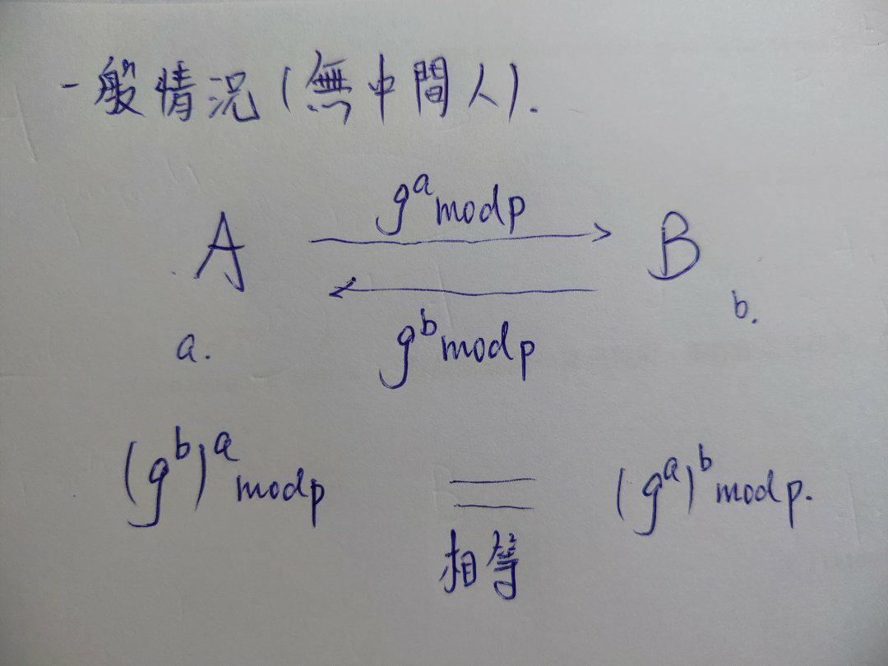

# Capture The Flag! 
NASA HW7 

b03901023 許秉鈞

### 1. Cryptolocker (10%)

#### The flag

`NASA{Ev3n_s3cure_PRF_1s_bre4k4ble_1f_u5ed_unc0rr3ctly}`

#### Explanation

#### 觀察

一開始輸入的 password 長度為 8，e.g. `abcd1234` ，他會以 2 bytes 為單位被切掉拿來做成 4 把 keys，做法是先把 encoding 轉成 utf-8 之後、用 hashlib 裡面的 sha256 建立，建立好之後存成 `ciphers[4]`，待會用到。

在加密的時候，會分別用這四把 keys 加密四層上去，這是 `enc()` 在做的事情。解密 `dec()` 則是反過來，用 key 解密之後再做 unpad，就得到原本的 plaintext。

我觀察到在 `dec()` 多了 unpad 這個步驟，於是我就往 padding 這方面去想：我把每一次 encrypt 之後的 one, two, three 長度印出來：結果如下，

```python
def enc(self, plaintext): 
    print(len(plaintext)) # 176
    one        = self.ciphers[0].encrypt(plaintext)
    print(len(one)) # 208
    two        = self.ciphers[1].encrypt(one)
    print(len(two)) # 240
    three      = self.ciphers[2].encrypt(two)
    print(len(three)) # 272
    ciphertext = self.ciphers[3].encrypt(three)
    print(len(ciphertext)) # 304
    return ciphertext
```

我發現每次長度都加了 32，反過來的 `dec()` 就是從 304 一直降回到 176。於是我猜測**應該是在每層加密時、 byte 長度變多或變少、而這造成可以攻擊的點之類的**。我用這個方向去搜尋，果然發現這題是 pad 出了問題（我參考的是 hack.lu 2016 很相近的題目，連結在底下 reference），證明我的猜測沒有錯。

#### 解法

一開始是想到 brute-force，因為 key 長度只有 8，這樣就是 64 bit 搜下去應該解得出來，只是時間複雜度很高。

接續前面的猜測， pad 的問題是出在於他 padding 的方式，觀察 `AESCipher.py` 裡面的實作，

```python
def _pad(self, s):
        return s + (self.bs - len(s) % self.bs) * AESCipher.str_to_bytes(chr(self.bs - len(s) % self.bs))
```

如果我們拿 `bs = 32`，拿 `s = "blabla"` （字串長度是 6）的話，`self.bs - len(s) % self.bs)` 就會是 `32 - 6 % 32` 結果是 26。然後他把這個 26 變成 char，再用 `str_to_bytes` 轉成 bytes、方便接在一起。接上去的數量則是`(self.bs - len(s) % self.bs)` 這麼多的 byte。

這個方法稱為 [PKCS7](https://en.wikipedia.org/wiki/Padding_%28cryptography%29#PKCS7) 。假設有個 block 他的大小是 8 bytes，然後他需要 pad 的長度是 4 bytes 的話，那補上去的 pad 會長得像是 `04 04 04 04`；也就是說，**PKCS7 這方法，他 pad 的長度就會是拿來 pad 的 byte 的值（最後面缺少 N 個 byte，就填入 N 個 byte 的 `N` ）**。

這危險的地方在於，我們可以從最後一個 byte 看出每次 decrypt 總共 pad 了多少，每個 pad 上去的 byte 他們的值又都一樣所以很好認。

一但 decrypt 出來的結果不符合 PKCS7 規則的填法，那他給的就會跟正確解出的結果不一致的訊息；也就是說，暴搜兩個 bytes、然後總會遇到 valid 的 padding 模式但是卻不是真正解出的結果的狀況。

暴搜的做法我是參考網路上的：

```python
from itertools import product
charset =  "0123456789abcdefghijklmnopqrstuvwxyzABCDEFGHIJKLMNOPQRSTUVWXYZ"  
# 題目雖然沒寫說 password 會是這幾個字元，但我用這些就已經試出來 flag，所以就沒考慮其他特殊符號了

for c1, c2 in product(charset, repeat=2):
    me = (c1 + c2).encode('utf-8') 
    key = sha256(me).digest() # 生成 key 暴搜，對答案
     
# c1, c2 的所有暴搜組合
# 0 0
# 0 1
# 0 2
# ...
# Z Z
```

因此我們只需暴搜 password 然後對明文解密、根據 padding 的情況來判斷是不是符合格式、進而看出 password 是否正確即可。 所以就會依序 found bytes: 出 `22` `71` `zz` `ji`，然後這八個密碼填入後就能成功生出 flag 了。

#### Script

請參考 `crack.py` 直接執行 `python crack.py` 就會生成一個 `flag.dec` 裡面 ciphertext 也就是要找的 flag。

[Link](https://stackoverflow.com/questions/12524994/encrypt-decrypt-using-pycrypto-aes-256) [Link](https://github.com/pwning/public-writeup/tree/master/hacklu2016/crypto200-cryptolocker) [Link](https://github.com/grocid/CTF/blob/master/Hack.lu/2016/README.md) [Link](https://gophers-in-the-shell.herokuapp.com/hack-lu-2016-cryptolock-crypto-200-pts/) [Link](https://blog.csdn.net/kevin66654/article/details/80453638)


### 2. 2AES (15%)

#### The flag

`NASA{Tw0_3qual5_to_0ne_Whyyyyyy}`

#### Explanation

這題我參考的是 Double DES 的 Meet-in-the-middle attack，見下圖：




攻擊點在於，假設兩把 keys 都一起暴搜，那複雜度是 $2^{23} \times 2^{23} = 2^{46}$ 會太高，不能解出來。但因為 Double DES 是個兩步驟的過程，如果**兩把 key 分開暴搜、然後再倆倆比對的話，那複雜度是 $2^{23} + 2^{23} = 2^{24}$ 這樣就能在五分鐘左右找到**。

細節的做法是這樣的： 原本的 encode 階段把 plaintext 丟進 DESCipher1 之後，會變成 middletext，然後再把 middletext 丟進 DESCipher2 就能得到 ciphertext。我開了兩個 array，長度都是 $2^{23}$，然後把每一把 key 都拿來用、 encrypt 這個 plaintext 之後存進 array 1 之中，並且每一把 key 也都拿來 decrypt 提供的 cipher 存進 array 2。這樣大約需要 5 分鐘。

接著我利用 numpy 的 `np.intersect1d()`  來找出這兩個 array 裡面，有哪兩個分別是一模一樣的值，如果交集只有一個的話，那就代表找到了 middletext 了。這樣需要 10 秒鐘。

最後，我們用 intersect 的結果，拿 `np.where()` 來用，因為我是用暴搜的、所以 array 的 index 就是他轉 byte 之前的值， `np.where( DESCipher1 == intersect )` 找到之後就可以取出兩把 key 的值了。這需要大約 1.5 秒鐘。

兩把 key 分別是 6809501 以及 3927445，然後兩個 key 會存在 `key` 這個檔案裡面，我的存法是，把 key0 乘上 $2^{23}$ 之後再加起來。這樣是為了呼應助教把 key 讀進來之後使用 `//`, `%` 來切成 key0, key1 的那段 code。

```shell
$ python3 2aes.py
[1] total time:  319.989098072052  sec
# 
intersect:  [b'\r\xbaN\xb4\xec\xc1\xc52\xb8\x06\xa3>\xa7\x92 \x1d']

[2] total time:  10.247816801071167  sec

key1:  6809501
key2:  3927445
[3] total time:  1.5541260242462158  sec
```

最後使用 aes2 提供的 encrypt, decrypt 就可以順利找到 flag 了！

#### Script

請參考 `2aes.py` 直接執行 `python3 2aes.py` 就會生成一個 `flag.dec` 裡面 ciphertext 也就是要找的 flag。

```python
# firstKey = 6809501
firstKey *= 2**23
# secondKey = 3927445
open("key", "w").write(str(firstKey+secondKey))
```

跑完 2aes 的結果會像這樣：



[Link](https://stackoverflow.com/questions/443967/how-to-create-python-bytes-object-from-long-hex-string) [Link](https://www.slideshare.net/hemantbeast/double-des-amp-triple-des)


### 3. Man in the Middle 2 (25%)

#### the flag

`NASA{Ahhhh...I_g0t_Mitm_4g41n...}`

#### Explantion

這題是我覺得本次作業最有趣的一題。




上圖是 diffie-Hellman 的一般情境。其中 g, p 為雙方已知。這次作業只有 7122 port 這一方，所以我們要用同一個 port 然後各自訂他們是 A 與 B。

以下是`mitm.py`裡面各個參數的介紹：

* p 是給定的，中間人也知道值
* round 總共 10 輪，跟 password 長度一樣
* m 是我在破解的時候自訂的亂數，我定為 `0x12345678`
* password 一共 10 位數，每個位數共有 [1, 20] 這些可能。也就是說，全部試過一輪的話會需要 $20^{10} = 1.024 \times 10^{13}$ 這麼多種可能性，所以無法硬爆。
* pwd 是 password 裡面每個字元拆開後，用 hex 還有 sha512 算出的亂碼，因此共有 10 個 pwd。
* g 是來自於 `pow(pwd, 2, p)` ，也就是說，假如讓 A 與 B 收到一樣的 password，那 pwd 每個 round 都一樣、則 A 和 B 每一輪所用的 g 也都一樣。
* b 是 `random.randint(2, p)`算出來的，中間人無法知道。
* key 是在 10 輪裡面每一輪都把 Key 拿來 XOR 算出來的。
* flag 是最後 key 和 secret 裡面的 FLAG 作 XOR 的結果。


硬爆的複雜度太高，但我們其實有辦法能**針對某個位數單獨硬爆，然後讓其他位數都抵銷沒有作用。**中間人的攻擊點在於，假設我今天想硬爆的位數是第 1 位數，那 2 到 10 位數我想把他們鎖住、讓他們不起影響。前者很簡單，就像是 lab 一樣傳一個 $g^{m} mod p$ 過去就可以，這個 m 是自己隨意訂的；後者則是在建立兩條連線時、我把那兩條連線的給我的 B 互換。等於說：兩個 server 在做 diffie Hellman，我做為中間人幫他們互換，如下：

```python
# server a, server b
# A, B are their public keys

B = getKey(a)
A = getKey(b)
sendKey(a, A)
sendKey(b, B)
```

首先，我從 server a 拿到 $B = g^{a} mod p$ ，接著我也從 server b 拿到 $A = g^{b}mod p$ ，然後我作為中間人，把這兩條連線給我的互換：把 $A$ 傳給 server a、 $B$ 傳給 server b。然後當他們在算出自己的 K 的時候， `K = pow(A, b, p) ` 這一行，這時 server a 算出來的就會是：$K = A mod p = g^{ab}modp$ ；而 server b 算出來的是 $K = Bmodp = g^{ab} mod p$。這樣保證兩方的 K 是相同的。那有什麼好處呢？

我們知道每一輪最後一步算 key 的時候，會把這輪的 K 跟前幾輪的 K 全部 XOR 在一起：

```python
key ^= int(hashlib.sha512(str(K)).hexdigest(), 16)
```

如果只有某一輪是傳 $g^{m} mod p$ 其他輪都是傳對方的 public key 的話，那剩下那九輪的結果，在我的中間人做這個步驟時：

```python
result = int(flag_a) ^ int(flag_b) ^ key1 ^ key2
```

這個 flag_a 與 flag_b 分別來自於他們各自的 10 個 K 作出 XOR 的結果。也就是說，因為他們雙方有 9 輪的 K 都是相同的，所以在 XOR 之後，就全部抵銷成 0000 了，只剩下那一輪 $g^{m} mod p$ 的和一堆 0 作 XOR，結果還是那一輪的值。


我們可把這個破解的演算法簡述如下：

```python
for c in (這串 password 的每個 index): # 0 to 9
    crack_index = c
	for (每一個 pwd candidate): # 1 to 20
    	a = remote(IP, PORT)
        b = remote(IP, PORT) # 建立連線
        
        for j in (一共 10 輪):
            
            if j == crack_index: # 這輪要破解的 index 是此位置
        		guess_pwd = ... # 把這輪猜的 pwd 拿來 hash
                
                # 收到 key 之後，傳中間人自己做的 gm 過去
                B = crackAndGetKey(a, guess_pwd) 
                A = crackAndGetKey(a, guess_pwd)
                # 這個 g^m mod p 是中間人可算出的
                key1 = ...
                key2 = ...
                
            else: # 不是此位置，就傳對方 public key
                B = getKey(a)
                A = getKey(b)
                sendKey(a, A)
                sendKey(b, B) # 等著被抵消就好
                
        # 拿到這 10 輪下來的 flag，可能對可能錯
        flag_a = printFlag(a)
        flab_b = printFlag(b)
        
        result = int(flag_a) ^ int(flag_b) ^ key1 ^ key2
        if result == 0:
            # 算對了！這個 pwd 就是這個 index 真正的值
            print '[found] the pwd at index ', c, 'is: ', i
            break
        
        # 繼續找下個 pwd candidate 
```

至於拿到每個位置的真正密碼後，要做的事就是讓中間人直接跟 server 互傳 10 輪正確的密碼，傳完之後就能拿到本題要的 flag 了。

```python
a = remote(IP, PORT)
key = 0x00000000 # 一開始設為 0，跟 mitm.py 一樣

for i, word in enumerate(password): # 一個個 word 傳過去
    pwd = int(hashlib.sha512(word).hexdigest(), 16)
    printRound(a) 
    B = crackAndGetKey(a, pwd) 
    K = pow(int(B), m, p) # 算出的 K 就是對方真正那個 K
    # 和 server a 做一樣的事
    key ^= int(hashlib.sha512(str(K)).hexdigest(), 16)

flag_a = printFlag(a)
flag = int(flag_a) ^ key # 最後再跟 key 作 XOR
flag = str(hex(flag)[2:].decode("hex")) # decode 出來就是正確結果

print flag 
# NASA{Ahhhh...I_g0t_Mitm_4g41n...}
```

#### Script

請參考 `crack.py` 直接執行 `python2 crack.py` 就會生成一個 `flag.dec` 裡面 ciphertext 也就是要找的 flag。


[Link](https://zh.wikipedia.org/zh-tw/%E8%BF%AA%E8%8F%B2-%E8%B5%AB%E7%88%BE%E6%9B%BC%E5%AF%86%E9%91%B0%E4%BA%A4%E6%8F%9B) [Link](https://zh.wikipedia.org/zh-tw/%E4%B8%AD%E9%97%B4%E4%BA%BA%E6%94%BB%E5%87%BB) [Link](https://www.youtube.com/watch?v=DgqID9k83oQ)
